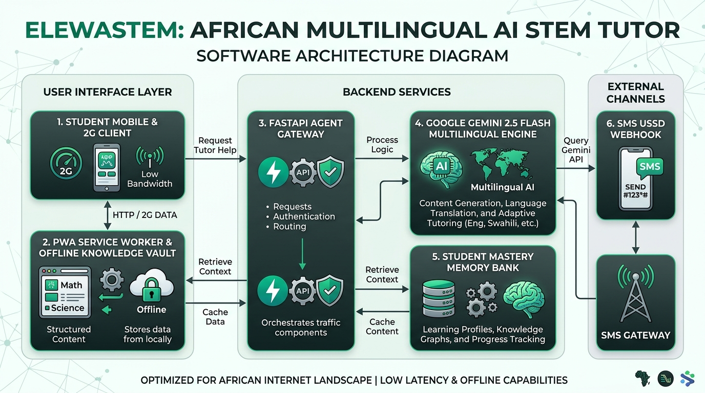
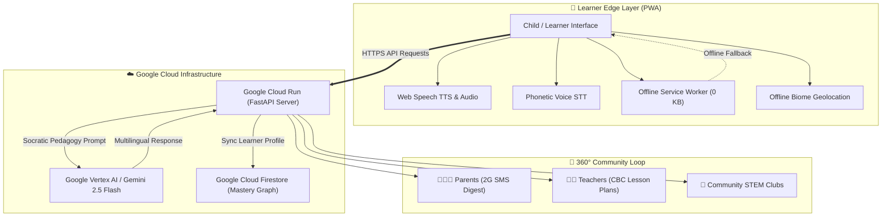

# 🌱 ElewaSTEM (Mwalimu STEM) — Pan-African Inclusive AI STEM Learning Ecosystem

> **"Usimeze, Elewa!"** — *Demystifying STEM for Every African Child in Their Own Language, Local Ecosystem, and Physical Ability.*

**ElewaSTEM** is an adaptive, offline-first multilingual AI STEM tutor and multi-stakeholder learning ecosystem designed specifically for children and young students across Africa. It bridges educational, language, accessibility, and connectivity barriers by explaining complex concepts in Physics, Mathematics, Biology, Chemistry, and Computing through **culturally and geographically grounded African ecological analogies**, **16+ African languages** (grounded in African NLP benchmarks like Masakhane, Lelapa AI / InkubaLM, and AfriSpeech), **universal special needs accessibility** (tactile audio for the blind, visual sign cues for the deaf, dyslexia typography), **architectures designed to support compliance with applicable African data-protection laws** (Kenya DPA 2019, Nigeria NDPA 2023, POPIA 2013, AU Malabo Convention), **multi-stakeholder portals** (Parents, Teachers, Community Mentors), and **offline-first edge architecture (core learning modules available offline after installation/download)**.

---

## 🏆 All Things Agentic Hackathon Submission Details

* **Selected Track**: **The Collaborative Partner**
* **Target Categories**: Grand Prize, Best Architectural Design, Best Multimodal & Inclusive UX, Operational Utility
* **Google Cloud Services Used**:
  * ☁️ **Google Cloud Run**: Serverless containerized deployment with auto-scaling.
  * 📦 **Google Cloud Build & Artifact Registry**: Automated CI/CD container build pipeline (`cloudbuild.yaml`).
  * 🗄️ **Google Cloud Firestore / Datastore**: Cloud synchronization for persistent student mastery profiles.
  * 🤖 **Google Vertex AI / Gemini 2.5 Flash & Google Gemma 2 (Open Weights Edge)**: Orchestrated via the official `google-genai` Python SDK.
* **Open Source Repository**: [https://github.com/ondinookello96/elewastem](https://github.com/ondinookello96/elewastem)
* **Devpost Project**: [https://devpost.com/software/elewastem-mwalimu-stem](https://devpost.com/software/elewastem-mwalimu-stem)

---

## 🌟 Key Innovations

1. **🌍 16+ Pan-African Languages Matrix & Indigenous Code-Switching**:
   * Grounded in **African NLP benchmarks** (Masakhane, Lelapa AI / InkubaLM, AfriSpeech).
   * Supports: **Kiswahili**, **Sheng (Mtaani)**, **Èdè Yorùbá**, **Harshen Hausa**, **Asụsụ Igbo**, **Naija Pidgin**, **አማርኛ (Amharic)**, **Afaan Oromoo**, **Af-Soomaali**, **isiZulu**, **isiXhosa**, **Ikinyarwanda**, **Oluganda**, **Twi (Akan)**, **chiShona**, **Lingála**, and **African English**.
   * Zero-bandwidth browser-native Speech Synthesis (TTS) and Speech Recognition (STT) localized for African phonetic systems.

2. **♿ Universal Accessibility & Special Needs Inclusion**:
   * 👁️ **Blind & Visually Impaired Learners**: Embedded **Tactile Audio Descriptions** (*"Shika jani bichi mkononi... hisi mishipa midogo ya xylem..."*) and ARIA semantic screen-reader markup.
   * 🧏 **Deaf & Hard-of-Hearing Learners**: Kenyan Sign Language (KSL) visual concept cues and process flowcharts.
   * 📖 **Dyslexia & ADHD Support**: 1-click dyslexia typography, letter-spacing expansion, and anti-glare cream theme.
   * 🌓 **High Contrast & Scalable Fonts**: Yellow-on-black contrast mode and multi-level text scaling.

3. **🏞️ Hyper-Local African Eco-Grounding & Hardware GPS**:
   * Dynamically adapts science analogies to 5 African biomes (**Lake Victoria Basin / Kisumu**, **Coastal Mangroves / Mombasa / Lagos**, **Agricultural Highlands / Eldoret / Mt. Kenya**, **Arid ASAL & Sahel / Turkana / Garissa / Kano**, and **Urban Metropolises**).
   * On-device GPS bounding box mapping with explicit parental consent gatekeepers.

4. **🛡️ Pan-African Data Protection Legal Governance Hub**:
   * Designed to support compliance with **8+ national data protection frameworks**, including:
     * 🇰🇪 **Kenya**: *Data Protection Act, 2019* (Section 29 on Children's Data; ODPC).
     * 🇳🇬 **Nigeria**: *Nigeria Data Protection Act, 2023 (NDPA)* (Section 31 on Child Protection; NDPC).
     * 🇿🇦 **South Africa**: *POPIA 2013* (Section 34/35 Special Information of Children; Information Regulator).
     * 🇬🇭 **Ghana**: *Data Protection Act, 2012 (Act 843)* (Section 37/38; DPC).
     * 🇺🇬 **Uganda**: *Data Protection and Privacy Act, 2019* (Section 8; PDPO).
     * 🇹🇿 **Tanzania**: *Personal Data Protection Act, 2022* (Section 30; PDPC).
     * 🇷🇼 **Rwanda**: *Law No. 058/2021 on Personal Data and Privacy* (Article 10; NCSA).
     * 🌍 **Pan-African Union**: *AU Malabo Convention on Cyber Security and Personal Data (2014)*.
   * Enforces on-device edge processing, zero cloud tracking, and 1-click statutory consent revocation.

5. **👥 360° Multi-Stakeholder Hub & Remote Parent Synchronization**:
   * **👨‍👩‍👧 Parents**: Automated 2G feature phone SMS progress digests via Africa's Talking API, remote pairing code (`ELEWA-7921`), remote parent magic link, and weekend kitchen science challenges.
   * **👩‍🏫 Teachers**: Automated CBC/NECTA-aligned lesson plans mapped to national curriculum strands with zero-budget local teaching aids.
   * **🤝 Community Mentors**: Village STEM club guides (bio-sand charcoal water filters, solar dryers).
   * **🔄 360° Continuous Feedback Loop**: Live community feedback feed and aggregated stakeholder sentiment metrics.

6. **📦 Offline-First Edge PWA (Core Modules Available Offline)**:
   * Progressive Web App caching with pre-compiled offline knowledge vaults (core learning modules available offline after installation/download; online AI features seamlessly activate with connectivity).

---

## 🏗️ System Architecture & Visual Diagram



### End-to-End Component Flow:



### High-Level Connectivity Flow:
```
+---------------------------------------------------------------------------------------------------+
|                                  CHILD / LEARNER IN AFRICA                                        |
|              (Low-Cost Smartphone, Tablet, Offline Browser, or 2G Feature Phone)                  |
+---------------------------------------------------------------------------------------------------+
                                                  │
                 ┌────────────────────────────────┴────────────────────────────────┐
                 ▼                                                                 ▼
      [ONLINE / CLOUD CONNECTED]                                    [OFFLINE / ON-DEVICE CACHED]
                 │                                                                 │
                 ▼                                                                 ▼
+------------------------------------+                         +------------------------------------+
|       GOOGLE CLOUD RUN             |                         |        OFFLINE PWA ENGINE          |
|    FastAPI Multilingual Gateway    |                         |    • Service Worker Vault          |
|    • 16+ African Languages Router  |                         |    • On-Device GPS Biome Mapper    |
|    • Pan-African DPA Legal Matrix  |                         |    • Browser-Native Speech (TTS)   |
|    • Multi-Stakeholder Feedback    |                         |    • Tactile Audio for Blind       |
+------------------------------------+                         |    • Sign Language Cues for Deaf   |
     │              │             │                            +------------------------------------+
     ▼              ▼             ▼
+----------+  +----------+  +----------+
|  Google  |  |  Google  |  | Africa's |
|  Gemini  |  |  Cloud   |  | Talking  |
|2.5 Flash |  |Firestore|  | 2G SMS   |
|  & Gemma |  | Mastery  |  | Webhook  |
+----------+  +----------+  +----------+
```

---

## 🚀 Spin-Up & Reproducible Deployment Guide

### 💻 1. Local Quick Start (Python Environment)

**Prerequisites**: Python 3.10+ installed.

```bash
# 1. Clone the repository
git clone https://github.com/ondinookello96/elewastem.git
cd elewastem

# 2. Install dependencies
pip install -r requirements.txt

# 3. (Optional) Set your Gemini API Key (offline engine works without a key)
export GEMINI_API_KEY="your_api_key_here"  # On Windows PowerShell: $env:GEMINI_API_KEY="your_api_key"

# 4. Launch the application server
python run.py
```
👉 Open your browser at **`http://localhost:8000`** to experience the full interactive PWA.

---

### 🧪 2. Run the Full Automated Test Suite (14 Verification Suites)

```bash
python test_suite.py
```
*Executes all **14 end-to-end automated test suites** validating health status, 16+ living African languages (Masakhane/Lelapa grounding), 8 Pan-African DPA statutory frameworks, adaptive Socratic Gemini chat, multi-sensory accessibility (tactile audio for blind, KSL sign language for deaf), vector SVG science diagrams, CBC teacher lesson plans, remote parent 2G SMS digests, community STEM clubs, multi-stakeholder feedback loops, ethical safety guardrails (ETHOS/OASIS), Maasai Elder multi-agent swarm orchestration (RANK/HUNT/TRAIL/CYCLE), and 8 African learning theories.*

---

### 🐳 3. Local Docker Spin-Up

```bash
# Build Docker image
docker build -t elewastem .

# Run container on port 8080
docker run -p 8080:8080 elewastem
```
👉 Access the containerized application at **`http://localhost:8080`**.

---

### ☁️ 4. Google Cloud Deployment (Production Ready)

#### Option A: One-Command Deployment to Google Cloud Run
```bash
# Authenticate with Google Cloud
gcloud auth login
gcloud config set project YOUR_PROJECT_ID

# Deploy directly to Google Cloud Run from source
gcloud run deploy elewastem \
  --source . \
  --region us-central1 \
  --platform managed \
  --allow-unauthenticated \
  --memory 1Gi \
  --cpu 1 \
  --set-env-vars GEMINI_API_KEY=your_gemini_api_key
```

#### Option B: Automated Google Cloud Build Pipeline
```bash
# Trigger automated container build and deployment via Cloud Build
gcloud builds submit --config cloudbuild.yaml
```
